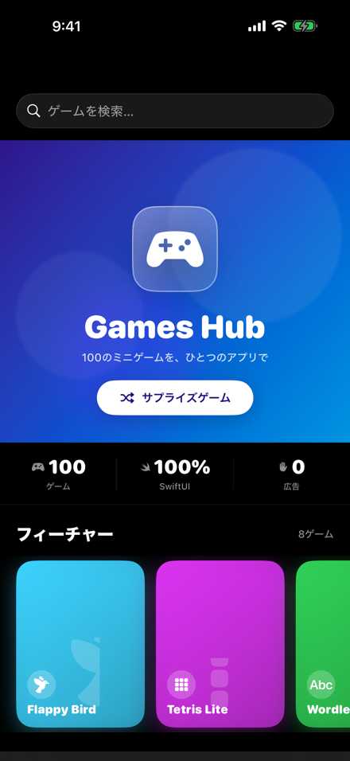
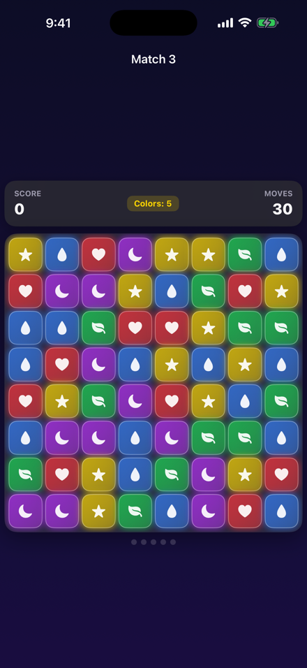
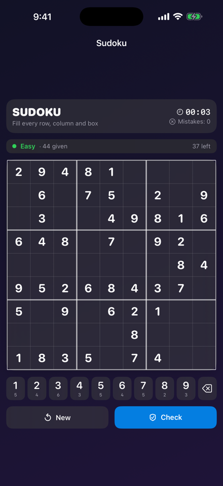
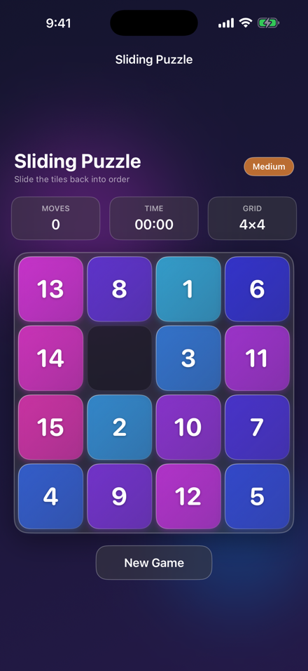
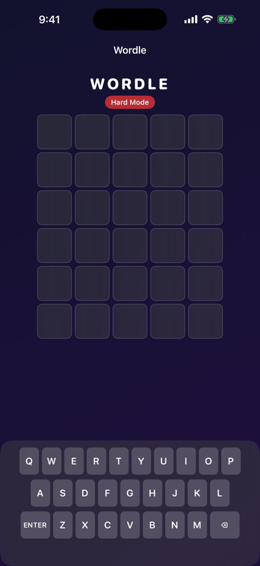
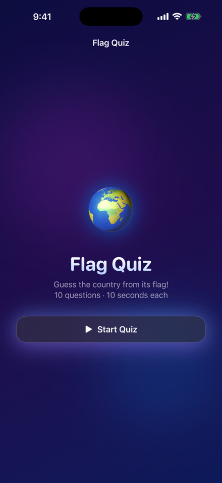

# 🕹️ GamesHub (iOS)

> 100種類のミニゲームを、ひとつの SwiftUI アプリに。

GamesHub は SwiftUI で実装した、100種類のミニゲームを収録したオールインワン・ゲームコレクション（iOS版）です。ハブ画面から好きなゲームをすぐに起動できます。

    

---

## 📸 スクリーンショット

| ハブ画面 | Match 3 | Sudoku |
|---|---|---|
|  |  |  |

| Sliding Puzzle | Wordle | Flag Quiz |
|---|---|---|
|  |  |  |

> ハブの一覧から直接ゲームに入れます。以前あったバージョン選択（Base / V2 / V3）は、1本化にともない撤去しました。

---

## ✨ 特徴

- **100 ミニゲーム** — Sudoku / Match3 / WordSearch / 2048 / Solitaire / Tetris など幅広いジャンルを収録
- **1ゲーム1実装** — 以前は各ゲームを Base / V2 / V3 の3版持っていたが、遊び比べたうえで最良の1本に統合した（300ファイル・約11.5万行 → 100ファイル・約4.2万行）。遊びとして成立していないものは、その場で作り直している
- **純 SwiftUI** — 外部ゲームエンジン非依存、すべてネイティブ実装
- **ハブ型ナビゲーション** — 1画面から全ゲームへアクセス
- **XcodeGen 管理** — `project.yml` からプロジェクトを再現可能に生成

---

## 🛠️ 技術スタック

| カテゴリ | 技術 |
|---|---|
| 言語 | Swift 5.9 |
| UI | SwiftUI |
| プロジェクト生成 | XcodeGen (`project.yml`) |
| 対応OS | iOS 17.0+ |
| Bundle ID | `com.gameshub.GamesHub` |

---

## 🚀 セットアップ

```bash
# リポジトリをクローン
git clone https://github.com/masafykun/GamesHub.git
cd GamesHub

# XcodeGen でプロジェクトを生成（未インストールなら: brew install xcodegen）
xcodegen generate

# Xcode で開いてビルド・実行
open GamesHub.xcodeproj
```

---

## ライセンス

[](https://opensource.org/licenses/MIT)

このプロジェクトは **MIT ライセンス** のもとで公開しています。

© 2026 masafykun (https://github.com/masafykun)
